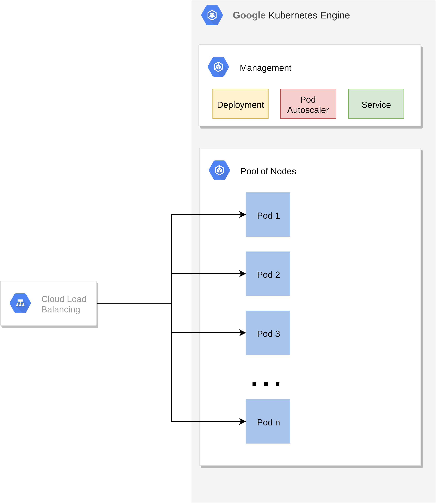

Scaling talk draft
==================

<!-- $size: 16:9 -->

- not just a talk, also demo at [bastiandg/scaling-in-the-cloud](https://github.com/bastiandg/scaling-in-the-cloud/)

---

# Scaling in the cloud

- cloud is not about cost, it is about scaling
- immutable infrastructure required
- Everything talks via http

<!--- side effect: acceleration-->
<!--- cost reduction? probably not [>TODO point still valid? If yes elaborate.<]-->

---

Scaling Ladder Illustration <!--TODO Colors-->

---

# Lift and shift

<!---->

- Migrate legacy VMs/Software with (almost) no modification
- Doesn't scale very well (bigger VMs, faster disks)
- Your mess for less
- Conclusion: don't do it

<!--https://pixabay.com/photos/house-uprooted-installation-1614922/-->

<!--- Velostrata-->

---

# immutable infrastructure

- Computing infrastructure doesn't change at runtime
- Operating System images are prebuilt
- Separation of storage and computing

---

# Autoscaled Host Groups

- Lift and Shift +
- Paradigm shift: VMs are containers
- Make infrastructure immutable
- Persist data outside VM
- vm scaling mechanisms of the cloud (gcp: managed instance group)

---

# Recipe Autoscaled Host Groups

- Packer
    - VM Image
- Terraform
    - VM Template
    - Managed instance group
    - Loadbalancer

<!--- Scaling unit: VM-->
<!--- Packer-->

---

# Demo Autoscaled Host Groups

---

# kubernetes

- Paradigm shift: There are no VMs <!--- TODO -->
- Pool of resources
- services containerized

---

# Ingredients kubernetes

- Terraform
    - Node Autoscaler
    - Kubernetes Cluster
- Docker
    - Container image
- Kubernetes
    - Deployment
    - Horizontal Pod Autoscaler
    - Service

---

# Kubernetes cluster

---

# Kubernetes deployment

---

# Kubernetes pod autoscaler

---

# Kubernetes service

---

# Demo kubernetes

---

# serverless

- Paradigm shift: There is no infrastructure <!--- TODO -->
- No infrastructure management
- Pay per use
- stateless

---

# Ingredients serverless

- Docker
    - Container Image
- Cloud Run
    - Deployment

---

# Demo serverless

---

# Takeaways

- Don't do lift and shift
- separate storage from computing

<!--- TODO Don't use Docker as a light VM-->
