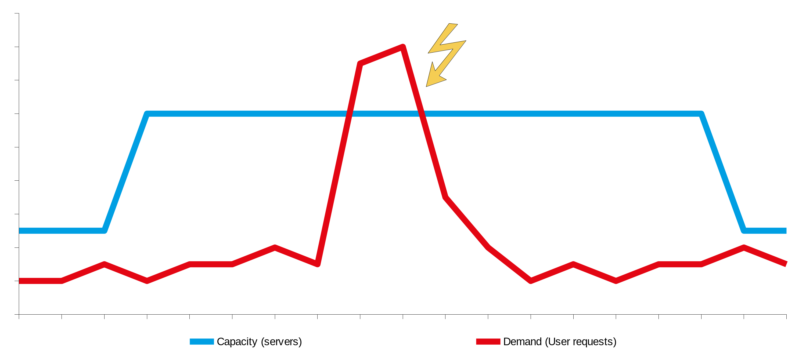
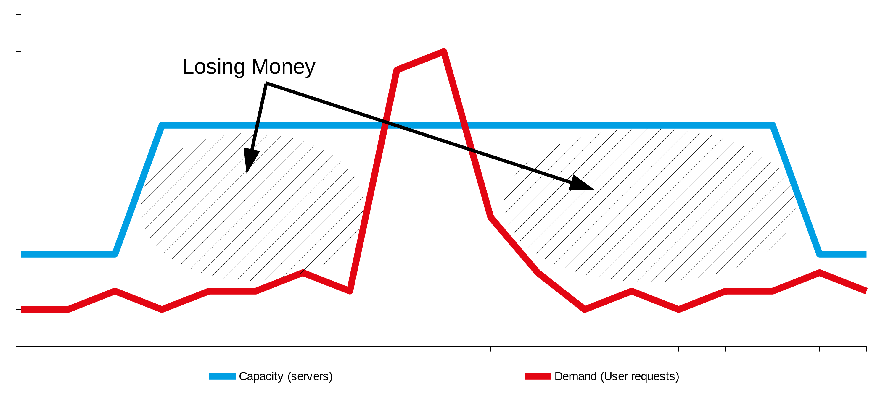
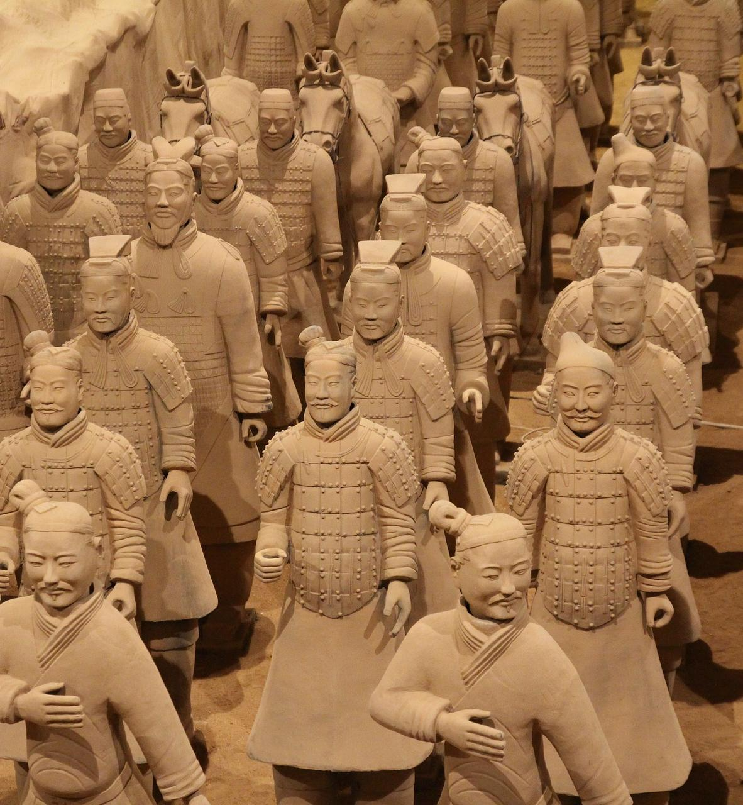
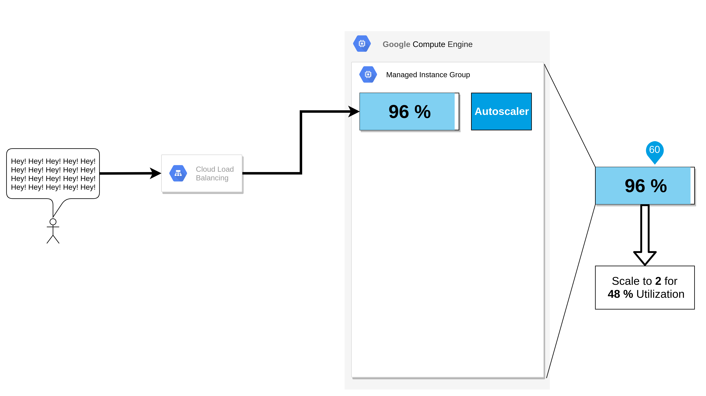
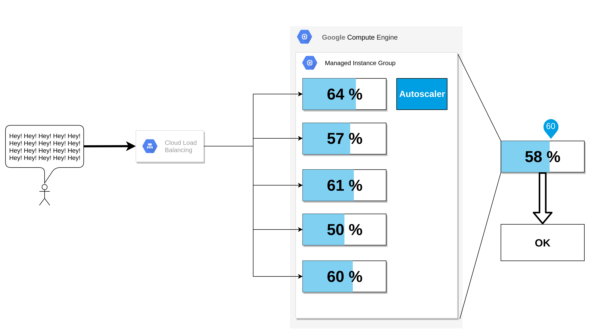
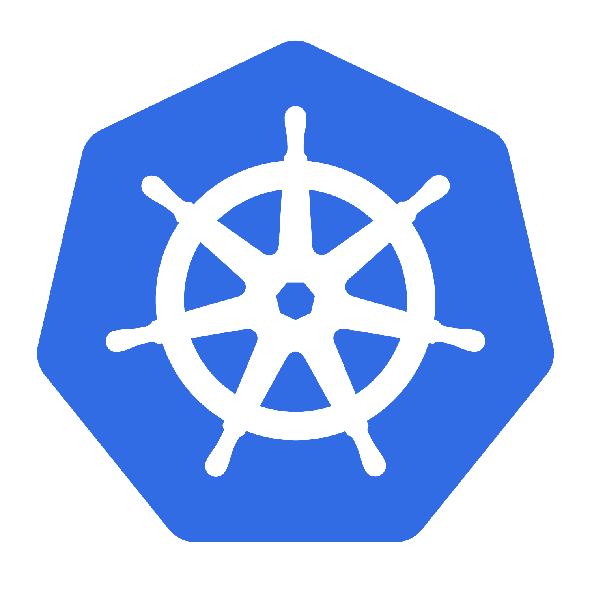
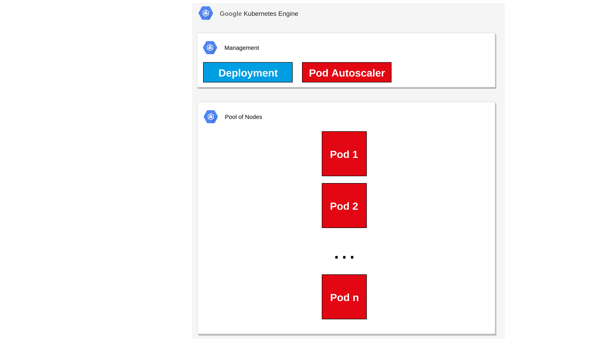
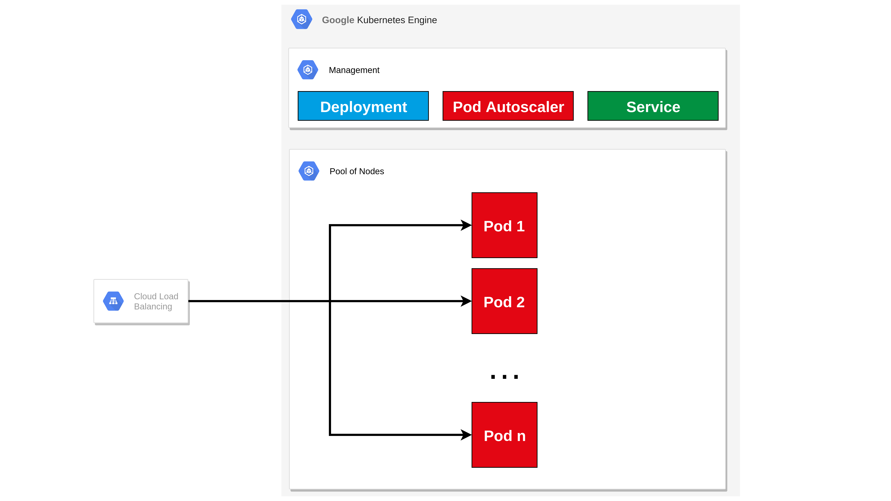
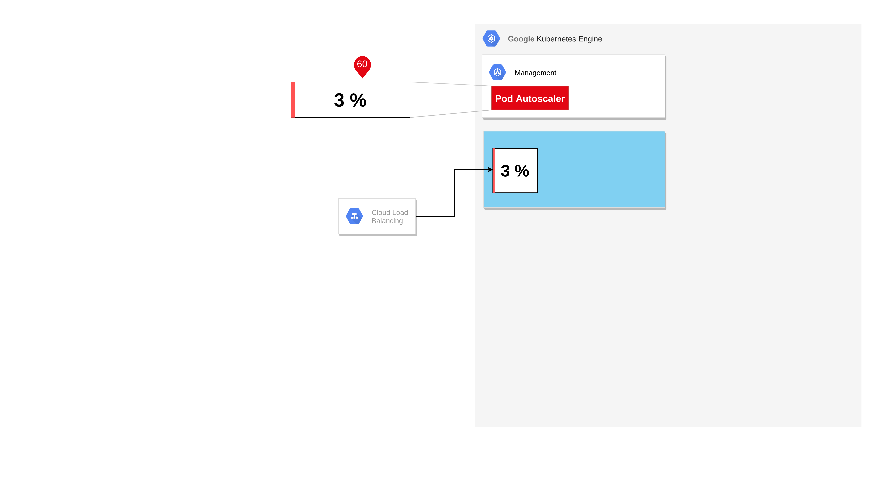
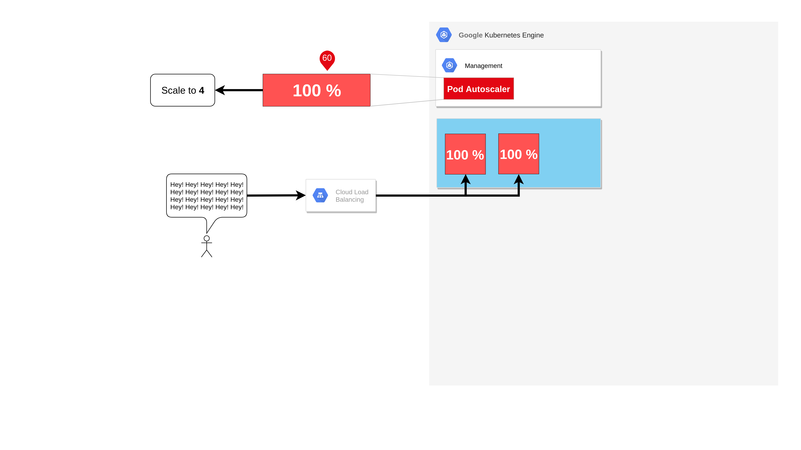

Climbing up the Scaling Ladder
==============================


<!--Alternative background https://www.flickr.com/photos/127932966@N07/15178278179/-->

<!-- $size: 16:9 -->

---

# Problem Statement

<style scoped>
section {
  font-size: 60px;
}
</style>

With inappropriate scaling you are losing customers 🏃 and money 💸.

<!--- side effect: acceleration-->

---

<style scoped>
section {
    text-align: center;
}
</style>


---

<style scoped>
section {
    text-align: center;
}
</style>


---

<style scoped>
section {
    text-align: center;
}
</style>



---

<style scoped>
section {
    text-align: center;
}
</style>



---

<style scoped>
section {
    text-align: center;
}
</style>


---


---

# Lift and Shift

<!---->


- Migrate legacy VMs / Software with (almost) no modification
- Doesn't scale very well (bigger VMs, faster disks)
- Your mess for less
- Conclusion: don't do it (in most cases)

<!--https://pixabay.com/photos/house-uprooted-installation-1614922/-->

<!--- Velostrata-->

<!-- # immutable infrastructure-->

<!--- Computing infrastructure doesn't change at runtime-->
<!--- Operating System images are prebuilt-->
<!--- Separation of storage and computing-->

---

# Autoscaled Host Groups


- Lift and Shift done right

Three Step process:
1. Persist data outside VM
2. Automate VM setup
3. Create VM image

<!--- Make infrastructure immutable-->
<!--- vm scaling mechanisms of the cloud (gcp: managed instance group)-->

---

# Example Autoscaled Host Groups

<style scoped>
table, td, th, tr {
    border: none;
}
</style>

| | |
|:--------:|-------------|
|  | - VM Image |
|  | - Managed Instance Group -> VM Autoscaler |
|  | - VM Template <br> - Managed instance group <br> - Loadbalancer|

<!--- Scaling unit: VM-->
<!--- Packer-->

---


# Managed Instance Group in GCP

<style scoped>
section {
    text-align: center;
}
</style>


---

# Example Application

- Hashy

```
bcrypt( time.now() )
```

---

# Demo Managed Instance Group Part 1


---

<style scoped>
section {
    text-align: center;
}
</style>


---

<style scoped>
section {
    text-align: center;
}
</style>


---

<style scoped>
section {
    text-align: center;
}
</style>


---

<style scoped>
section {
    text-align: center;
}
</style>



---

<style scoped>
section {
    text-align: center;
}
</style>


---

<style scoped>
section {
    text-align: center;
}
</style>


---

<style scoped>
section {
    text-align: center;
}
</style>



---

# Demo Managed Instance Group Part 2


---

# Container Orchestration

<style scoped>
section {
    padding: 40px;
}
</style>

<!--https://pixabay.com/photos/search/harbor%20container/-->
<!--https://pixabay.com/photos/hamburg-port-of-hamburg-3021820/-->
<!--https://pixabay.com/photos/port-ships-cranes-load-containers-675539/-->
<!--https://pixabay.com/photos/port-ships-cranes-load-containers-614543/-->

- Paradigm shift: There are no VMs <!--- TODO -->
- Pool of resources
- Services containerized
    -> strip out OS
    -> runtime image instead VM image

---

# Example Container Orchestration

<style scoped>
table, td, th, tr {
    border: none;
}
</style>

| | |
|:--------:|-------------|
|  | - Kubernetes Cluster <br> - Node Autoscaler|
|  | - Container Image |
|  | - Deployment <br> - Horizontal Pod Autoscaler <br> - Service|

---

# Kubernetes Cluster

<style scoped>
section {
    text-align: center;
}
</style>


---

# Kubernetes Deployment

<style scoped>
section {
    text-align: center;
}
</style>


---

# Kubernetes Pod Autoscaler

<style scoped>
section {
    text-align: center;
}
</style>



---

# Kubernetes Service

<style scoped>
section {
    text-align: center;
}
</style>



---

# Demo Kubernetes Part 1


---

<style scoped>
section {
    text-align: center;
}
</style>


---

<style scoped>
section {
    text-align: center;
}
</style>



---

<style scoped>
section {
    text-align: center;
}
</style>


---

<style scoped>
section {
    text-align: center;
}
</style>



---

<style scoped>
section {
    text-align: center;
}
</style>


---

<style scoped>
section {
    text-align: center;
}
</style>


---

<style scoped>
section {
    text-align: center;
}
</style>


---

<style scoped>
section {
    text-align: center;
}
</style>


---

# Demo Kubernetes Part 2


---

# Serverless


- Paradigm shift: There is no infrastructure <!--- TODO -->
- No infrastructure management
- Pay per use
- Stateless

---

<!--border-bottom: 0px solid black;-->
# Example Serverless
<style scoped>
table, td, th, tr {
    border: none;
}
</style>

| | |
|-|-|
|  | Container Image |
|  | Deployment |

---

# Demo Serverless


---

# Takeaways


- Scalability is a fundamental requirement
- Cloud providers make scaling easy
- Don't do lift and shift

<!--- Separate storage from computing-->
<!--- TODO Don't use Docker as a light VM-->
