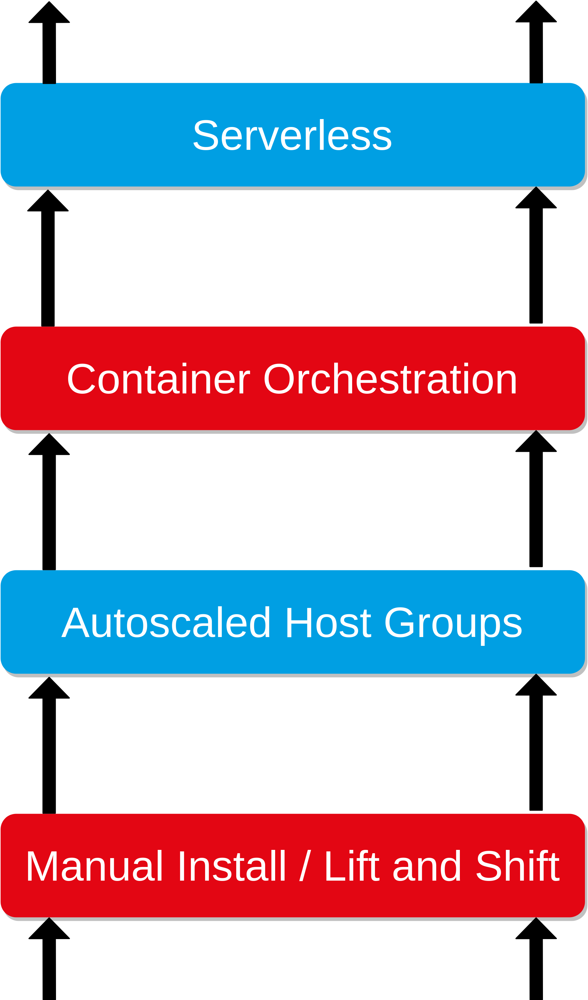
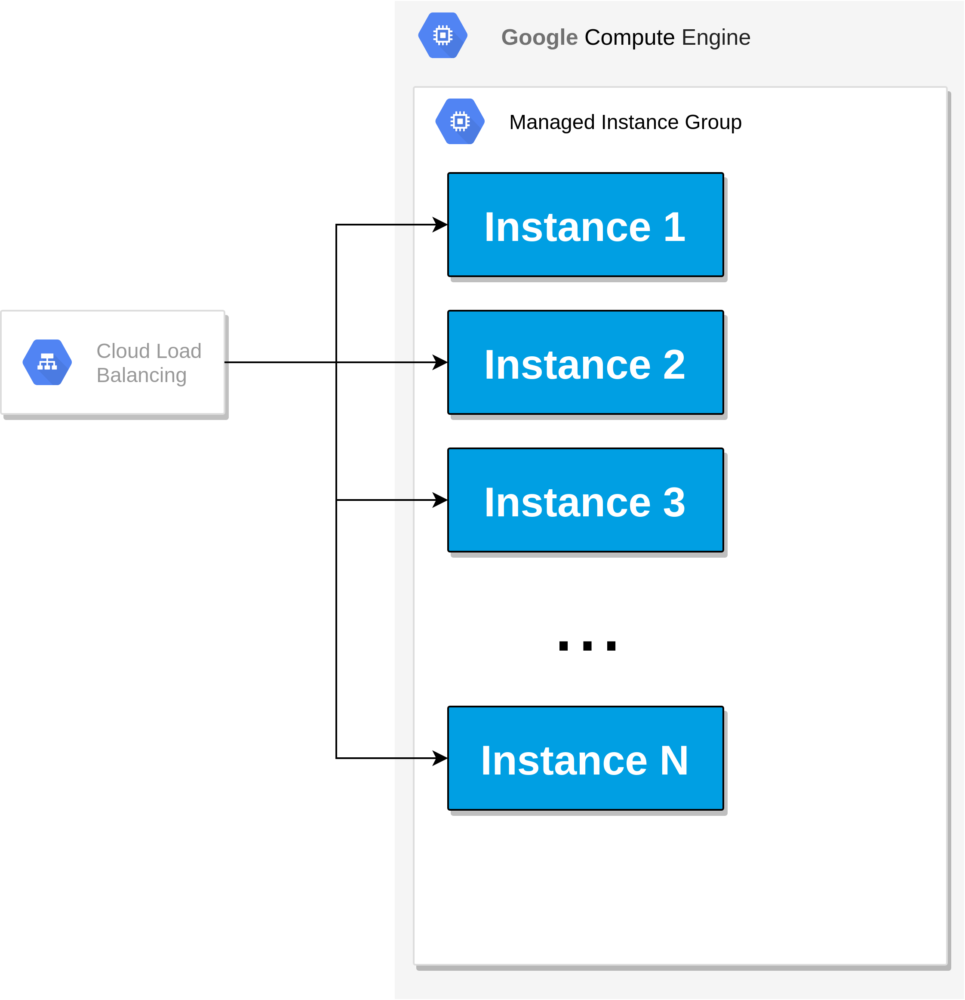
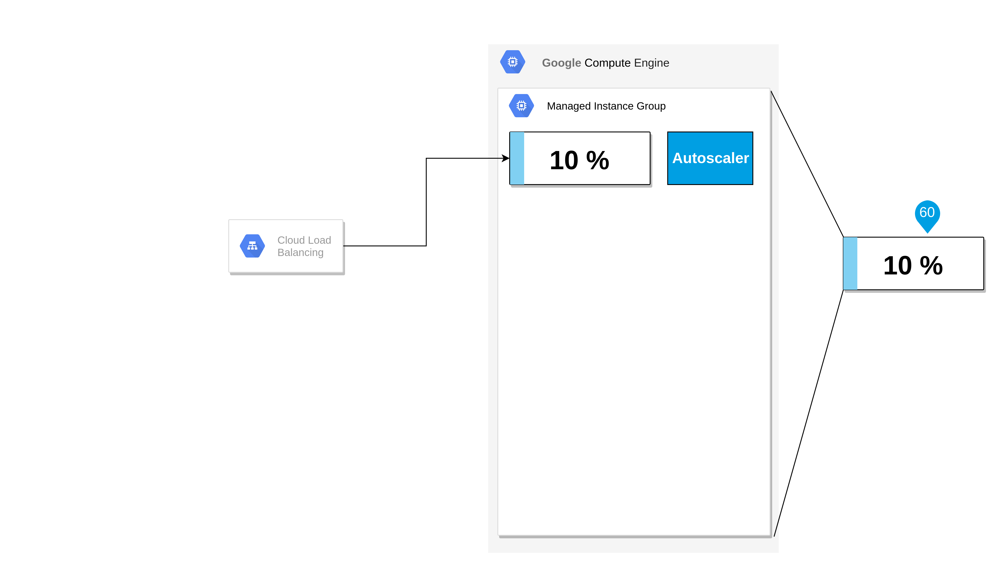

Climbing up the Scaling Ladder
==============================


<!-- $size: 16:9 -->

---

# Scaling in the Cloud

- Disclaimer: Focus on standard applications (not Machine Learning or Storage)
- 3 Scaling scenarios (with examples)
- Demos at [scale.8c.at](https://github.com/bastiandg/scaling-in-the-cloud/) ⚖️8️🐱
- Cloud is not about cost, it is about scaling
- Reduced cost is a side effect

<!--- side effect: acceleration-->

---



---

# Lift and Shift

<!---->


- Migrate legacy VMs / Software with (almost) no modification
- Doesn't scale very well (bigger VMs, faster disks)
- Your mess for less
- Conclusion: don't do it (in most cases)

<!--https://pixabay.com/photos/house-uprooted-installation-1614922/-->

<!--- Velostrata-->

<!-- # immutable infrastructure-->

<!--- Computing infrastructure doesn't change at runtime-->
<!--- Operating System images are prebuilt-->
<!--- Separation of storage and computing-->

---

# Autoscaled Host Groups


- Lift and Shift done right
- Paradigm shift: VMs are containers
- Make infrastructure immutable
- Persist data outside VM
<!--- vm scaling mechanisms of the cloud (gcp: managed instance group)-->

---

# Example Autoscaled Host Groups

<style scoped>
table, td, th, tr {
    border: none;
}
</style>

| | |
|:--------:|-------------|
|  | - VM Image |
|  | - Managed Instance Group -> VM Autoscaler |
|  | - VM Template <br> - Managed instance group <br> - Loadbalancer|

<!--- Scaling unit: VM-->
<!--- Packer-->

---


# Managed Instance Group in GCP

<style scoped>
section {
    text-align: center;
}
</style>



---

# Example Application

- Hashy

```
bcrypt( data=time.now(), cost=12 )
```

---

# Demo Managed Instance Group Part 1


---

<style scoped>
section {
    text-align: center;
}
</style>


---

<style scoped>
section {
    text-align: center;
}
</style>



---

<style scoped>
section {
    text-align: center;
}
</style>


---

<style scoped>
section {
    text-align: center;
}
</style>


---

<style scoped>
section {
    text-align: center;
}
</style>


---

<style scoped>
section {
    text-align: center;
}
</style>


---

<style scoped>
section {
    text-align: center;
}
</style>


---

# Demo Managed Instance Group Part 2


---

# Container Orchestration

<!--https://pixabay.com/photos/search/harbor%20container/-->
<!--https://pixabay.com/photos/hamburg-port-of-hamburg-3021820/-->
<!--https://pixabay.com/photos/port-ships-cranes-load-containers-675539/-->
<!--https://pixabay.com/photos/port-ships-cranes-load-containers-614543/-->

- Paradigm shift: There are no VMs <!--- TODO -->
- Pool of resources
- Services containerized

---

# Example Container Orchestration

<style scoped>
table, td, th, tr {
    border: none;
}
</style>

| | |
|:--------:|-------------|
|  | - Kubernetes Cluster <br> - Node Autoscaler|
|  | - Container Image |
|  | - Deployment <br> - Horizontal Pod Autoscaler <br> - Service|

---

# Kubernetes cluster

<style scoped>
section {
    text-align: center;
}
</style>


---

# Kubernetes Deployment

<style scoped>
section {
    text-align: center;
}
</style>


---

# Kubernetes Pod Autoscaler

<style scoped>
section {
    text-align: center;
}
</style>


---

# Kubernetes Service

<style scoped>
section {
    text-align: center;
}
</style>


---

# Demo Kubernetes Part 1


---

<style scoped>
section {
    text-align: center;
}
</style>


---

<style scoped>
section {
    text-align: center;
}
</style>


---

<style scoped>
section {
    text-align: center;
}
</style>


---

<style scoped>
section {
    text-align: center;
}
</style>


---

<style scoped>
section {
    text-align: center;
}
</style>


---

<style scoped>
section {
    text-align: center;
}
</style>


---

<style scoped>
section {
    text-align: center;
}
</style>


---

# Demo Kubernetes Part 2


---

# Serverless


- Paradigm shift: There is no infrastructure <!--- TODO -->
- No infrastructure management
- Pay per use
- Stateless

---

<!--border-bottom: 0px solid black;-->
# Example Serverless
<style scoped>
table, td, th, tr {
    border: none;
}
</style>

| | |
|-|-|
|  | Container Image |
|  | Deployment |

---

# Demo Serverless


---

# Takeaways


- Don't do lift and shift
- Cloud providers make scaling easy

<!--- Separate storage from computing-->
<!--- TODO Don't use Docker as a light VM-->
